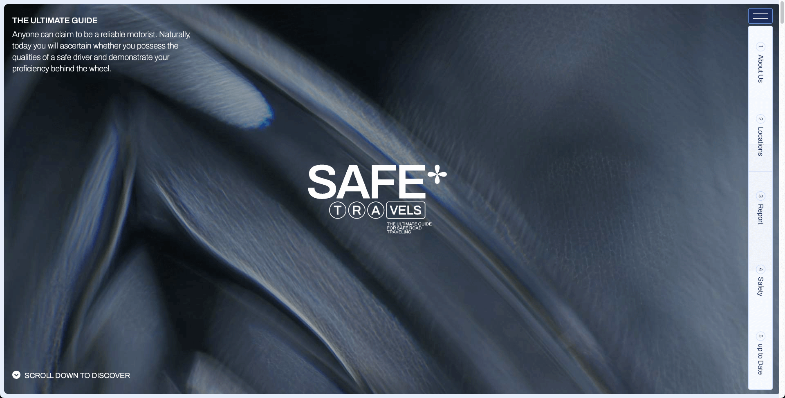

## Time: 00:00
Data: 04:00  | 08.19  
DAILY: -00:00
 

# BoilerPlate Nuxt3 and Prismic


  


// Working: [ Game Page ] System

### Colors:


  
   
  
  
  
  
  
  
  
  
  
###	 Infos site
Web:
```bash 

html {
	--gap: 3rem;
	--menu-size: 6rem;
	--menu-dist: calc(1rem + 5px);
	--color: #1c2d59;
	--soft: #C3C8C3;
	--white: #fff;
	--yellow: #e5c762;
	--gray: #6f6f6f;
	--decor: var(--yellow);
	--blue1: var(--color);
	--blue2: #061c53;
	--blue3: #4761a1;
	--blue4: #6b95df;
	--blue5: #c5d8fb;
	--blue-light: #f6f9ff;
	--bg: #e6edfa;
	--parag: var(--color);
	--dark: #3E3131;
	--black: #000000;
	--line-color: var(--blue5);
	--line-color-soft: #d8bfc0;
	--lineColor: #d8bfc0;
	font-size: calc(100vw / 1920 * 10);
	width: 100vw;
	font-family: var(--serif);
	color: var(--color);  
	--sans: nhd-roman, sans-serif;
	--light: nhd-light, sans-serif;
	--medium: nhd-roman, sans-serif;
	--serif: Archivo, sans-serif;
	--parag: var(--sans);
	--title: ppf, sans-serif;
	font-family: var(--sans);
}
@media screen and (max-width: 479px) {
	html {
		font-size: calc(100vw / 540 * 10);
		--gap: 3rem;
	}
}

@media screen and (max-width: 767px) and (min-width: 480px) {
	html {
		font-size: calc(100vw / 900 * 10);
	}
}

@media screen and (max-width: 991px) and (min-width: 768px) {
	html {
		font-size: calc(100vw / 1100 * 10);
	}
}

@media screen and (max-width: 1365px) and (min-width: 992px) {
	html {
		font-size: calc(100vw / 1728 * 10);
	}
}

}


```

#### Pages Templates
<ul>
	<li>Index</li>
	<li>About</li>
	<li>Blog</li>
	<li>Article</li>
</ul>
